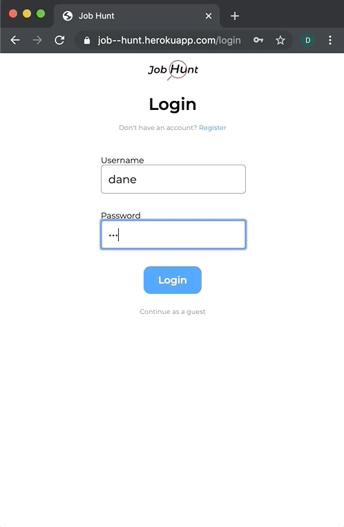

# Job Hunt
🔎 An application to help users organize their job search.

# Technologies Used

* JavaScript
* Node
* Express
* React
* MySQL
* react-router
* Webpack
* styled components

# Live Site

Try it out live at: https://job--hunt.herokuapp.com

If you don't want to register, use the guest login located below the login button

# Features

* User can register and login and logout
* User can add applications to their dashboard
* User can specify what date they applied,
  the company they applied to,
  the position they applied for,
  the status of their application,
  the date of an upcoming interview,
  and any notes about the job posting
* User can filter applications by their status (waiting, interview, rejected)
* User can search for specific companies they have applied for
* User can edit all parts of the tracked application
* User can delete an application

# Preview



# Development

#### System Requirements

* Node
* MySQL

#### Getting Started


1. Clone the repository.

    ```
    git clone https://github.com/danemaison/job_hunt.git
    cd job_hunt
    ```

1. Install dependencies
    ```
    npm install
    ```

1. Create a .env file in the
    ```
    touch .env
    ```

1. Specify secret variables inside the .env file
    ```
    PORT=3002
    DEV_SERVER_PORT=3001
    TOKEN_SECRET=secret
    ```

1. Start up the app
    ```
    npm run dev
    ```
